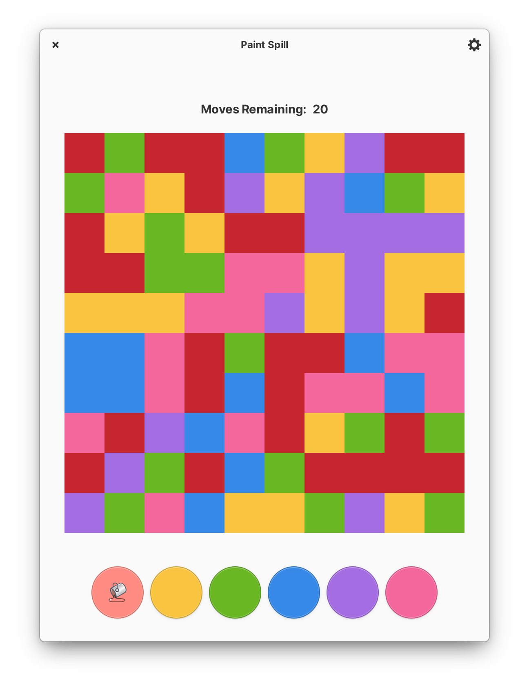
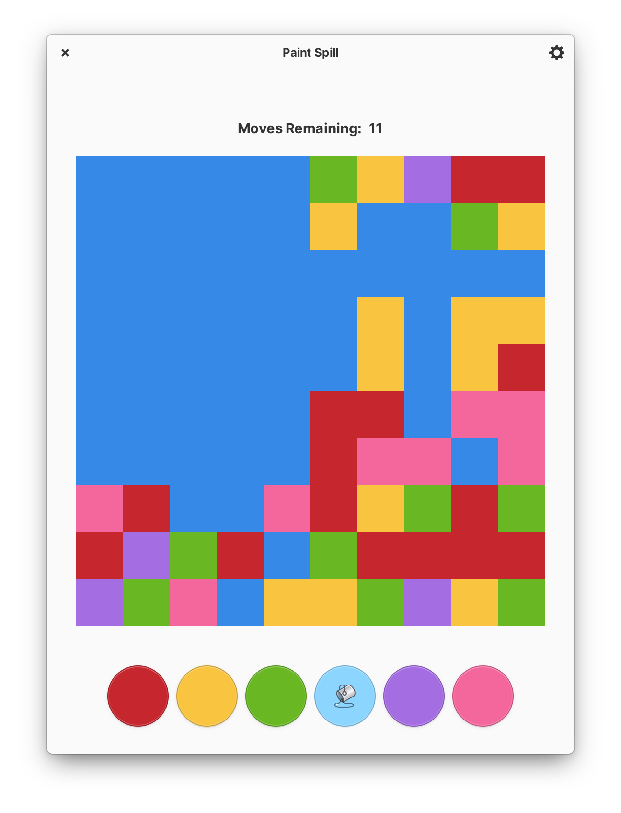
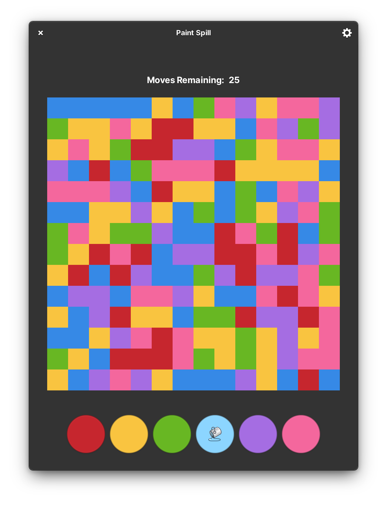

<p align="center">
  
</p>
<h1 align="center">Paint Spill</h1>
<!-- <p align="center">
  <a href="https://appcenter.elementary.io/com.github.avojak.paint-spill"></a>
</p> -->

## Fill the board with all the same color!

The classic color-filling puzzle game, designed for elementary OS.

|  |  |  |
|------------------------------------------------------------------|------------------------------------------------------------------|------------------------------------------------------------------|

## Install with Flatpak

Even if you are not on elementary OS, you can install Paint Spill from the elementary Flatpak repository:

```bash
$ flatpak install https://flatpak.elementary.io/repo/appstream/com.github.avojak.paint-spill.flatpakref
```

## Install from Source

You can install Paint Spill by compiling from source. Flatpak is the preferred method of building Paint Spill:

```bash
$ flatpak-builder build com.github.avojak.paint-spill.yml --user --install --force-clean
$ flatpak run --env=G_MESSAGES_DEBUG=all com.github.avojak.paint-spill
```

### Updating Translations

When new translatable strings are added, ensure that `po/POTFILES` contains a
reference to each file with the translatable string.

Update the `.pot` file which contains the translatable strings:

```
$ ninja -C build com.github.avojak.paint-spill-pot
```

Generate translations for the languages listed in the `po/LINGUAS` files:

```
$ ninja -C build com.github.avojak.paint-spill-update-po
```