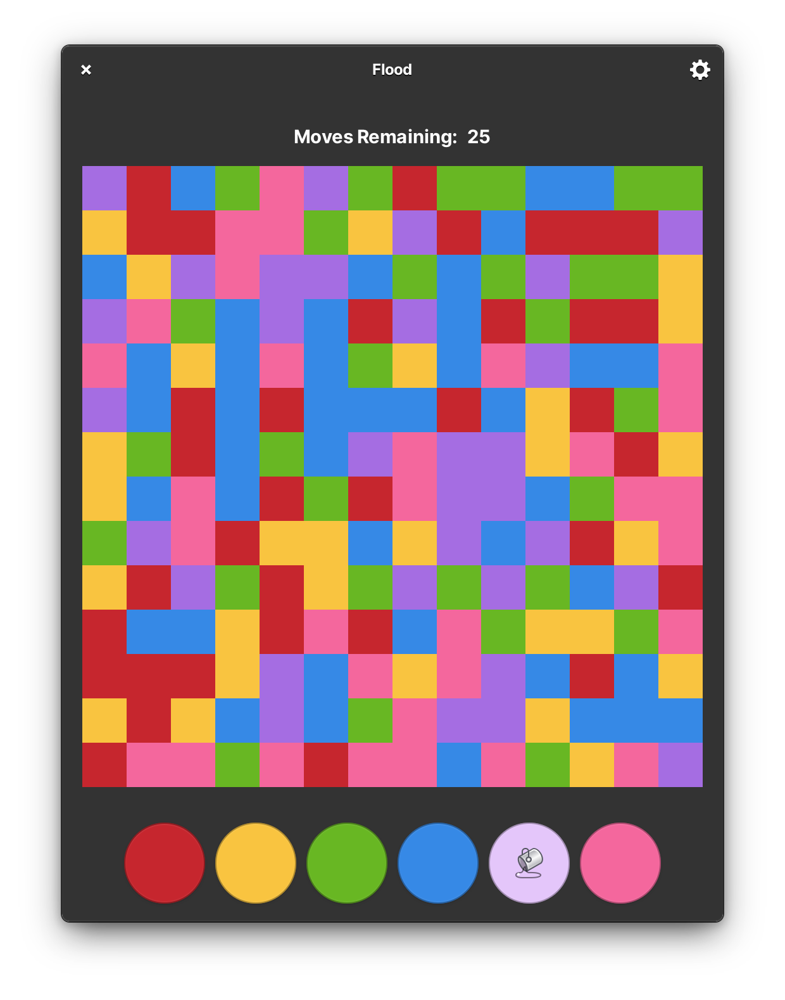

<p align="center">
  
</p>
<h1 align="center">Flood</h1>
<!-- <p align="center">
  <a href="https://appcenter.elementary.io/com.github.avojak.flood"></a>
</p> -->

## Flood the board with all the same color!

The classic puzzle game, designed for elementary OS.

|  |
|------------------------------------------------------------------|

## Install from Source

You can install Flood by compiling from source. Here's the list of
dependencies required:

- `libgranite (>= 6.2.0)`
- `libgtk-3-dev (>= 3.24.20)`
- `libgee-0.8-dev (>= 3.24.20)`
- `libhandy-1-dev (>= 1.2.0)`
- `meson`
- `valac (>= 0.28.0)`

## Building and Running

```
$ meson build --prefix=/usr
$ sudo ninja -C build install
$ com.github.avojak.flood
```

### Flatpak

Flatpak is the preferred method of building Flood:

```bash
$ flatpak-builder build com.github.avojak.flood.yml --user --install --force-clean
$ flatpak run --env=G_MESSAGES_DEBUG=all com.github.avojak.flood
```

### Updating Translations

When new translatable strings are added, ensure that `po/POTFILES` contains a
reference to the file with the translatable string.

Update the `.pot` file which contains the translatable strings:

```
$ ninja -C build com.github.avojak.flood-pot
```

Generate translations for the languages listed in the `po/LINGUAS` files:

```
$ ninja -C build com.github.avojak.flood-update-po
```